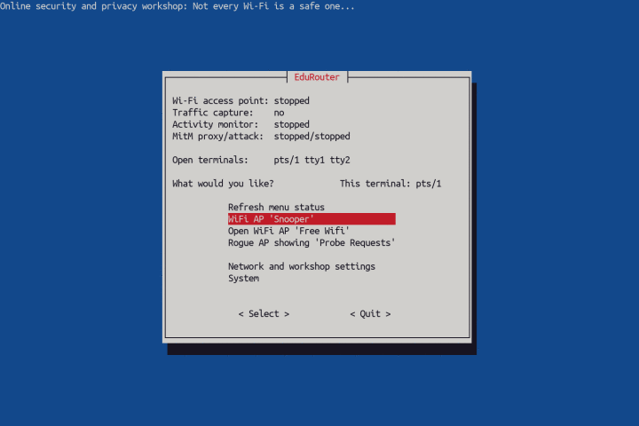

# EduRouter

Give a new life to an old laptop and make it useful again. Turn it into an **educational wireless auditor-router.**



-----

## The purpose

Seeing is believing.

Mainstream operating systems (both desktop and mobile) have became spying devices and personal data collectors.

The purpose of this project is to help non-geeks and users without Linux/networking experience build wireless router (with display, keyboard and menu control) to see:
* where are wireless devices (phones, tablets, computers, TVs) communicating to
* where and how often particular application communicates
* what information can see "Wi-Fi owner" (parents, school, employer) or ISP/government
* why public or unknown Wi-Fi should not be trusted
* why one should not trust computer she/he doesn't own (e.g. internet kiosk in a hotel)
* what is the difference between normal connection, VPN or Tor

-----

## Installation

### Prerequisites

You will need:

* An old laptop with Ethernet **and** Wireless interface.
* USB stick you can erase. (To install Debian GNU/Linux from it.)
* Working computer and internet. (To download Debian and make installation USB stick on it.)

Very old laptop will work fine! (512 MB of RAM will work, 1 GB is more than enough). 32 bit architecture (such as Asus Eee) is OK as well. __Yes, upcycle that old machine and make it happy again.__

### 1. Install Debian GNU/Linux

Be sure to download .iso installation image from [here](https://cdimage.debian.org/cdimage/unofficial/non-free/cd-including-firmware/current/multi-arch/iso-cd/) (because we do not know what type of processor your old laptop has and what particular hardware is inside it) and create bootable USB disk from that image.

Plug __Ethernet cable__ with internet access into your old laptop, boot from USB and install Debian __without Desktop environment, only with standard tools.__ 

TODO: Installation process. (No password for root; automatic use of the whole disk; __uncheck GNOME__, check ssh if you want to continue over ssh, __check Standard tools__. Reboot.) (Advanced users may prefer to install more than one OS and use laptop for another purpose as well, especially those with 4 GB RAM and 200+ GB hard drive.)

### 2. Install EduRouter

While connected to network/internet using Ethernet cable, log into your freshly installed Debian laptop and type three commands below into terminal. First command will change working folder, second command will download installation script and third command will run installation script.

If message 'command not found' is shown when you enter `wget ...` command, you probably didn't install standard tools during installation of Debian. Run `sudo apt install wget` to install it and run again.

```
cd /tmp

wget https://raw.githubusercontent.com/rozvara/EduRouter/main/install.sh

bash install.sh
```

The installation script will download and install all necessary tools and packages, and then reboots.
When you log in again, the menu will help you start Wi-Fi router and use tools installed.

-----

## Documentation

### Caution

The main goal - to have working access point for workshops to show people how modern cloud/surveillance era works and demonstrate that every router in a way is a computer which someone controls - works.

Anything else (phishing attack, reading https traffic to demonstrate man in the middle and/or danger of public wifis, mitm scripts) is __work in progress__ and probably will be too difficult for beginners. Those features should be considered as proof of concept.

In another words, there is a lot of work. Feedback and ideas are welcome.

### First run

TODO.

Log in: type username, type password.

'q' to quit screensaver (and "welcome to matrix").

Type password (sudo explanation).

Select interfaces.

From menu 'Network settings':

	1. Connect to WAN (DHCP)

	2. Test internet

	3. Set wifi name and pre-shared key

Go back to Main menu:

	4. Start wifi access point

	5. Watch activity in real time

To change settings, wifi must be switched off.

### Connect to network in a new environment

TODO.

(Ethernet / USB Wireless dongle / Smartphone USB tethering)

(DHCP / Static IP + manual config edit)

(Problem solving)

### Use cases

TODO.

mitmproxy certificate installation to "hacked" machine (mitm.it while mitm mode is active)


### Control

TODO.

m for menu (from command line)

q when 'pager'

Enter when 'Press Enter'

Ctrl-C when 'watch'

Ctrl-C when 'MitM attack' (mitmdump)

F10/q in wireowl, htop

q in mitmproxy, termshark

Keys in wireowl (arrows, q, F8...)

Keys in mitmproxy (Enter, q, arrows, z...)

Ctrl+Alt+F1 to F6 (or Super+F1 to F6) to change terminals

ssh (w/ key) is everybody's friend


### How it works

TODO.

Explain what's in .local/bin/ - how all those scripts 'er-something' work ('m' is alias for er-menu)

Explain what's in .config/

Explain what's in .cache/

Explain what's in /var/www/ and how to customize fake web pages.

Explain how extra hosts file for hostapd/dnsmasq works.

Explain how Python scripts for mitmproxy work.

Advanced use (not in menu: M, ttyecho, macchanger...)

-----

## Roadmap

In no particular order I plan to add or change:

- [ ] Manuals for school teachers for their 'digital literacy' workshops

- [ ] DNS-over-TLS blocking optionally (now always blocks to see requests while auditing)
- [ ] Option to block DNS-over-HTTPS w/ customization of providers
- [ ] DNS spoofing demo
- [ ] JavaScript injection demo
- [ ] Option for DNS Ad-blocking
- [ ] Option for custom blocking (domain, port, IP address) (Firewalling/blocking demos)
- [ ] Better phishing demo (may be with captive portal)

Feedback is welcome. Tips, ideas and pull requests as well.
